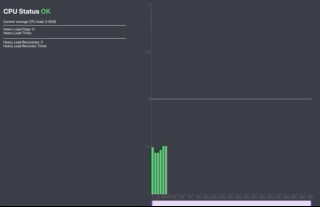
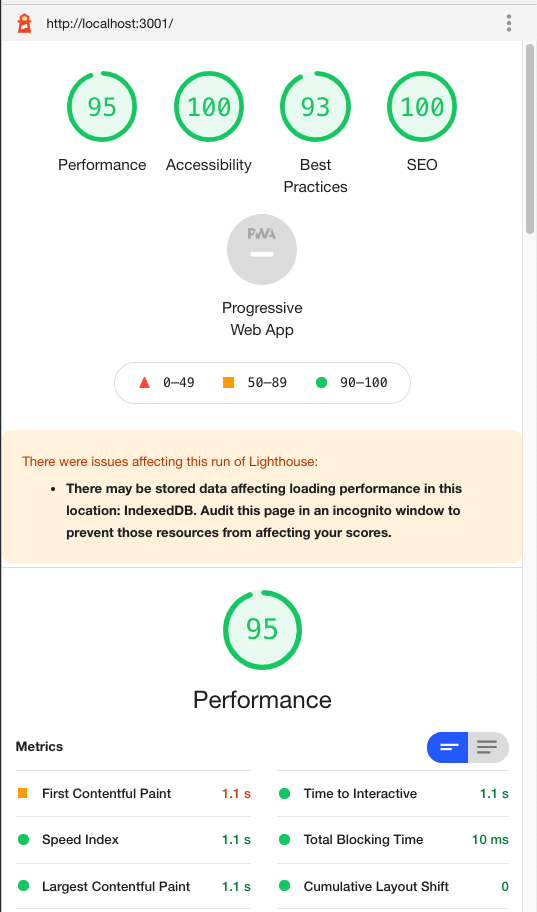

# Cpu Monitor
Application with a client that pings a simple backend service for CPU load data

```
.--------.  ping  .--------.
| Client |  --->  | Server |
|        |  <---  |        |
'--------' vitals '--------'
```




## Table of Contents

- [Setup](#Setup)
- [Improvements](#Improvements)
- [License](#License)


## Setup

- Node v14.16.0
- Npm v6.14.11

1) Download dependencies for client
```shell
$ npm install
```

2) Start the backend service that gathers CPU vitals
```shell
$ npm run start:be
```

3) Start client side react 
```shell
$ npm run start:fe
```


## Improvements
- Overall this was a super fun app to work on!
- For fetching cpu data we're using a `setInterval` and cleaning up whenever the component unmounts. In a real-world environment where it could take longer than expected to get CPU load, constantly fetching at an interval can cause [congestion](https://weblogs.asp.net/bleroy/setinterval-is-moderately-evil). `setTimeout` is a way to mitigate this.
- To ship this for production we would need to do a number of significant changes. Right now we poll a local for data, but in the real world the responsibilties would be switched. Clients typically install a script we provide. This script pushes relevant data to our servers, and from there present it on a clean UI. To validate and tie users to requests we could provide an APP_ID or USER_ID.
- Lighthouse Performance Audit



## License

[](http://badges.mit-license.org)
[](https://github.com/styled-components/styled-components)

- **[MIT license](http://opensource.org/licenses/mit-license.php)**
- Copyright 2019 © <a href="https://www.linkedin.com/in/jscho13/" target="_blank">Joseph Cho</a>.

